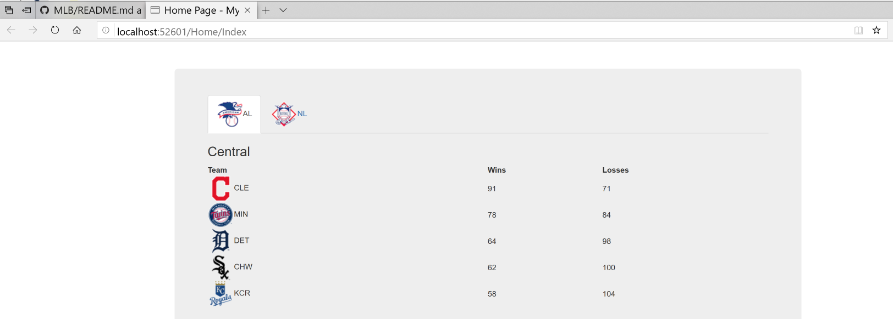

# MLB Code Challange
Scott Stahurski
========




ASP MVC C# 
========
This was written with Visual Studio 2017. 
I did test this as well by opening up with Visual Studio 2015 and it worked as well.  
  
Clone this repository and open the MLB Code Challenge.sln.  
After that you must build the solution. Build | Build Solution  
Then you will run the program by selecting Debug | Start Debugging or selecting the Run icon on your tool bar ▶  

Code Features
========
The project is an Model View Controller project, so there are the respected Model, View, Controllers directories.

Controllers Directory  
========
HomeController.cs  
```c#
public class HomeController : Controller
    {
        public ActionResult Index()
        {
            //read in from the web the team data
            //create the service 
            var teamService = new TeamsService();

            //get the Org data from the service
            MLBOrganization org = teamService.GetMLBStandings();

            return View("Index",org);
        }

    }
```  
As you can see the HomeController creates an instance of the TeamService object that retrieves the information from the web from the link that was provided.  https://api.mobileqa.mlbinfra.com/api/interview/v1/records
After the TeamService object is created, the GetMLBStandings parses out the JSON records and creates an MLBOrganization object, whic contain all of the Leagues, Divisions, and Teams in a sorted order.  

The Index page is then started, and the MLBOrganization object is passed to it as a Razor object.

Models Directory  
========
These are basically the POCO objects created for parsing and holding the information.  

Services Directory  
========
There is one file, TeamsServices.cs which is a file that downloads the JSON data and creates a MLBOrgganization object.  

```c#
    public class TeamsService
    {

        public MLBOrganization GetMLBStandings()
        {
            //URL with the data
            var url = "https://api.mobileqa.mlbinfra.com/api/interview/v1/records";

            List<TeamDataRecord> records = new List<TeamDataRecord>();

            //make the call to the webservice
            using (WebClient webClient = new WebClient())
            {
                records = JsonConvert.DeserializeObject<List<TeamDataRecord>>(webClient.DownloadString(url));
            }

            MLBOrganization organization = new MLBOrganization(records);

            return organization;

        }
    }

```

Views Directory  
========
In the Views\Home Directory there is an Index.cshtml file that displays the data.  
Leagues have their own tab, and the teams fade in when displayed.  
```html
<!-- setup the league tabs -->
    <ul class="nav nav-tabs">
        @{

            Boolean firstTab = true;
            foreach (MLB.Models.League league in Model.leagues)
            {
                //name the tab #href to the league name

                <li class=@(firstTab?"active":"")><a data-toggle="tab" href="#@league.leagueName">@league.leagueName</a></li>
                firstTab = false;

            }
        }
    </ul>
```

Code Hilights
--- 
Robust, if the data changes , for example a new league ( say Canadian League or Cuban League) is added, this code will handle it and its divisions and teams.  

Use of bootstrap for visual display, as well as icons were used.  

Last there are also a few basic unit tests for the data, TeamsServices, and the POCO objects.


